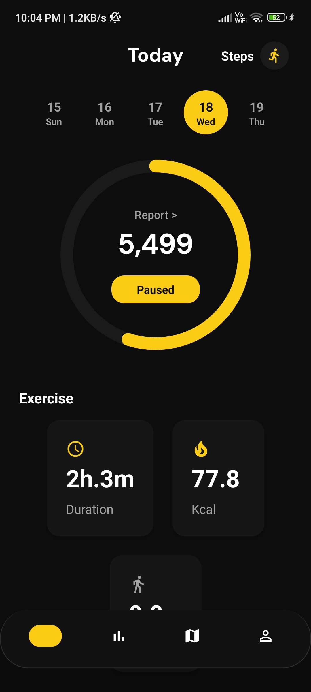
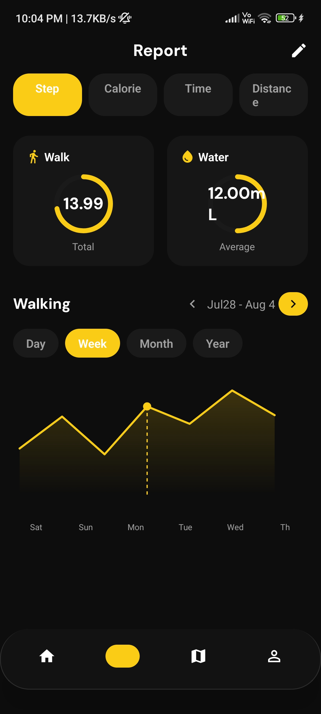
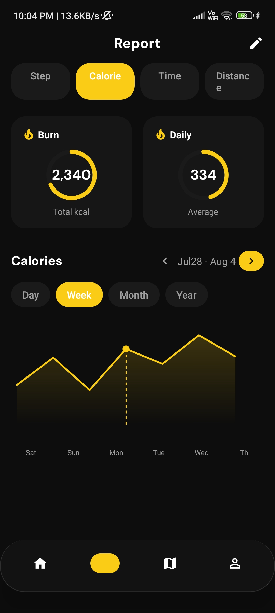
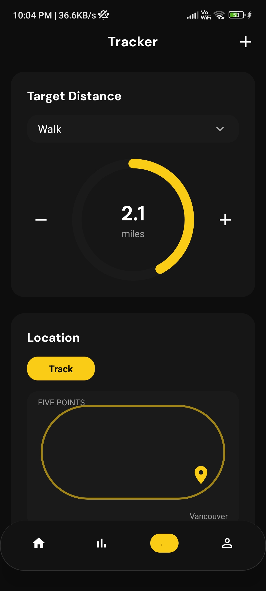
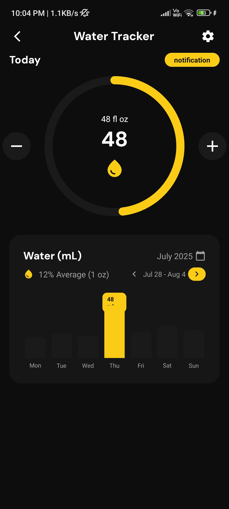
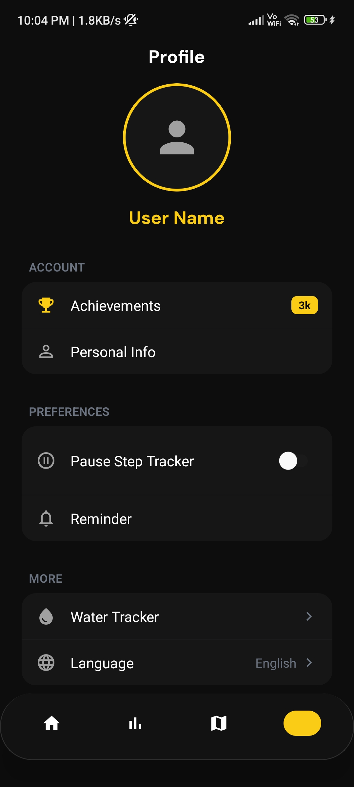

# 🚀 MetricMe — Your All-in-One Wellness Tracker

**Track. Improve. Thrive.**  
MetricMe brings together *steps, calories, hydration, sleep,* and more into one smart, beautifully designed experience — helping you build a healthier lifestyle every day.

---

## 📸 Screenshots

<p align="center">
  
  
  
  
  
  
</p>


## ✨ Key Features

- 🏃‍♂️ **Step Counter** — Accurate real-time tracking using device sensors  
- 🔥 **Calorie Burn Insights** — Personalized metrics based on your body profile  
- 💧 **Hydration Tracking** — Smart reminders + daily water goals  
- 😴 **Sleep Awareness** — Monitor daily rest patterns  
- 🧠 **Mood & Wellness Logs** — Understand your mind-body connection  
- 🌤️ **Environment Awareness** — Temperature, humidity & air quality insights  
- 🔔 **Reminders & Streaks** — Stay motivated with goals and achievements  
- 📊 **Progress Analytics** — Weekly reports, trends & visualization  
- 🎯 **Custom Goals** — Tailored to your lifestyle and health needs  

> MetricMe = Health + Motivation + Intelligence in one place 🧩

---

## 🧩 Tech Stack

| Category | Technology |
|---------|------------|
| Framework | React Native (Expo) |
| State Management | Context API / Redux (TBD) |
| Sensors | Expo Sensors |
| Charts | react-native-chart-kit / Victory Native |
| Storage | AsyncStorage / Local DB |
| Notifications | Expo Notifications |
| Backend (Future Scope) | Firebase / Supabase |

---

## 📱 Screenshots (Coming Soon)

> UI is under rapid development — sleek design previews arriving shortly 👀✨

---

## 🚧 Development Status

MetricMe is currently in **active development**.  
We’re polishing the UI and integrating core functionality:

- [x] Basic UI Layout  
- [ ] Step & Calorie Logic  
- [ ] Water Tracker  
- [ ] User Profile + Goals  
- [ ] Analytics Dashboard  
- [ ] Notifications  
- [ ] Launch on Play Store / App Store 🚀  

---

## 🛠️ Installation & Setup

```sh
git clone https://github.com/AayushKrGupta/MetricMe.git
cd MetricMe
npm install
npm start
